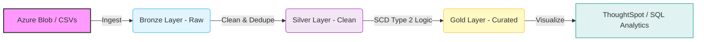

# ❄️ Snowflake Enterprise Data Pipeline & Analytics


> **A production-ready Data Engineering project showcasing a Medallion Architecture (Bronze/Silver/Gold), automated ELT pipelines, SCD Type 2 historical tracking, and self-service BI integration.**

---

## 🏗️ Architecture Overview

This project simulates a real-world enterprise data environment. It ingests raw data from **Azure Blob Storage** and **CSVs**, processes it through a multi-layered pipeline using **Snowflake Stored Procedures**, and serves insights via **ThoughtSpot**.



---

## 📂 Repository Contents

This repository contains **17 SQL scripts** organizing the end-to-end workflow, from infrastructure setup to advanced governance.

### 1️⃣ Infrastructure & Configuration

| File Name | Description |
| --- | --- |
| **`Connecting_Azure_Data_Stages.sql`** | ☁️ **Azure Integration:** Configures Storage Integrations, External Stages, and schemas (Bronze/Silver/Gold). |
| **`Create_DB.sql`** | 🏗️ **Database Setup:** Initial script creating `DEMO_DB` and the `EMP` table for CSV ingestion. |
| **`Titanic_Table_Creation.sql`** | ⚙️ **Parquet Config:** Defines the `TITANIC` schema and custom `PARQUET` file formats. |
| **`load_to_azure.sql`** | 🔌 **Legacy Config:** Initial Azure integration setup (kept for reference on storage policies). |

### 2️⃣ Ingestion (Bronze Layer)

| File Name | Description |
| --- | --- |
| **`Titanic_manual_load.sql`** | 📥 **ELT Ingestion:** Loads raw Parquet data into staging, parsing variant columns (e.g., `$1:Age`) on-the-fly. |
| **`Verifying_Data_Load.sql`** | ✅ **Quality Assurance:** Immediate row count checks and data integrity verification post-load. |

### 3️⃣ Transformation (Silver Layer)

| File Name | Description |
| --- | --- |
| **`sp_load_silver_titanic.sql`** | 🤖 **Stored Procedure:** Automates cleaning, casting, and deduplication (using `QUALIFY ROW_NUMBER`). |

### 4️⃣ Dimensional Modeling (Gold Layer)

| File Name | Description |
| --- | --- |
| **`SCD2.sql`** | 📐 **DDL:** Defines the `dim_passenger_scd2` table structure for Slowly Changing Dimensions. |
| **`sp_load_dim_passenger_scd2.sql`** | 🔄 **SCD Type 2 Logic:** Complex Stored Procedure using **Hash Diffs** to detect changes and track history (`effective_start/end_date`). |
| **`Data_Analysis.sql`** | 📊 **Reporting Marts:** Aggregates data for BI (e.g., `survival_by_age_group`, `survival_by_class`). |

### 5️⃣ Orchestration

| File Name | Description |
| --- | --- |
| **`Call_Procs.sql`** | 🚀 **Pipeline Trigger:** Single entry point to execute the Silver and Gold stored procedures sequentially. |

### 6️⃣ Advanced Analytics (Ad-Hoc)

| File Name | Description |
| --- | --- |
| **`Titanic_Queries.sql`** | 🚢 **Deep Dive:** Analytical queries on survival rates, demographics, and class privileges. |
| **`Basic_Queries.sql`** | 🔎 **Employee Stats:** Fundamental filtering, sorting, and aggregation on the Employee dataset. |
| **`Temporary_Table_Queries.sql`** | 🧪 **Session Analysis:** Uses Temporary Tables for complex text parsing (Email domains) and tenure calculations. |
| **`Monthwise_Hires.sql`** | 📅 **Time Series:** Reporting query to analyze hiring trends specifically for the year 2017. |

### 7️⃣ Data Governance & DevOps

| File Name | Description |
| --- | --- |
| **`Zero_Copy_Cloning.sql`** | 🐑 **Cloning:** Creates instant "Sandbox" environments for safe testing without data duplication. |
| **`Time_Travel.sql`** | ⏳ **Disaster Recovery:** Demonstrates restoring dropped tables or deleted rows using `AT(TIMESTAMP)` and `UNDROP`. |

---

## 📸 Screenshots & Output
[📄 View Project Screenshots (PDF)](./Project_Summary_&_Screenshots.pdf)

---
## 🌟 Key Highlights

### 🚄 Automation

* **Stored Procedures:** All transformation logic is encapsulated in SQL-based Stored Procedures.
* **Orchestration:** The entire pipeline from Silver to Gold can be refreshed with two simple `CALL` commands.

### 🧠 Advanced Modeling

* **SCD Type 2:** Implemented full history tracking. If a passenger's record changes, the old record is expired, and a new active record is inserted.
* **Hash Diffing:** Uses `HASH(col1, col2...)` to efficiently detect changes in large datasets without full row comparisons.

### 🛡️ Governance & Safety

* **Zero Copy Cloning:** Enables specific "Dev/Test" branches of the database in seconds.
* **Time Travel:** Provides a safety net allowing the database to be queried as it existed in the past (up to 90 days).

## 🛠️ Tech Stack

* **Snowflake Data Cloud** (Warehousing, Compute, Governance)
* **SQL** (Transformation, DDL, DML)
* **Microsoft Azure** (Blob Storage Integration)
* **ThoughtSpot** (Business Intelligence & Visualization)

---

*Created by Ronit Shetty*

```

```
